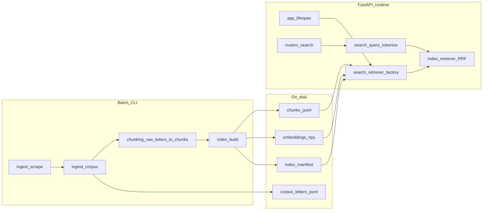

# Mental model: FDA hybrid RAG PoC (for code review)

Use this as a **5–7 minute spine**: **decoupled batch pipeline** writes **versioned artifacts**; **FastAPI** only **loads** them and runs **retrieve → fuse → respond**. Single source of truth for intent: [implementation-plan.md](../../context/plans/implementation-plan.md).

---

## One diagram (batch vs query)

---

## Layer 1: Collecting data (`ingest/`)

| Piece | Role |
|--------|------|
| [`ingest/scrape/`](../src/fda_regulations/ingest/scrape/main.py) | **Discovery**: hub page + **DataTables AJAX** pagination to list letter URLs; **one GET per letter** for detail HTML. Models (`RawLetterDocument`) carry `letter_id` (URL slug), URLs, dates, company name, **raw HTML**. |
| [`ingest/corpus.py`](../src/fda_regulations/ingest/corpus.py) | **Persist** scrape output as **`letters.jsonl`** + **`corpus_manifest.json`** so chunking/indexing can **re-run without hitting FDA**. |
| [`ingest/scrape/letter_text.py`](../src/fda_regulations/ingest/scrape/letter_text.py) | Optional **plain-text extraction** for human QA previews (`--preview-dir`); **not** the canonical store for chunking (chunking uses HTML). |

**Interview line:** Ingest is **HTML in, stable ids + metadata out**; it does **not** know about BM25 or embeddings.

---

## Layer 2: Processing / chunking (`chunking/`)

| Piece | Role |
|--------|------|
| [`chunking/paragraphs.py`](../src/fda_regulations/chunking/paragraphs.py) | Pull **`
`** text from **`article#main-content`** (FDA Drupal)—**one chunk ≈ one paragraph**. |
| [`chunking/cfr.py`](../src/fda_regulations/chunking/cfr.py) | **Regex** CFR-shaped strings **per chunk** → stored on `ChunkRecord.cfr_citations` (**metadata for citations/reporting**; **not** used in retrieval today). |
| [`chunking/chunk_letter.py`](../src/fda_regulations/chunking/chunk_letter.py) | **`chunk_id = letter_id:paragraph_index`**; attaches letter URL, dates, company. |
| [`chunking/models.py`](../src/fda_regulations/chunking/models.py) | **`ChunkRecord`** Pydantic model (narrow types at boundaries). |
| [`chunking/__init__.py`](../src/fda_regulations/chunking/__init__.py) | **`raw_letters_to_chunks`**: iterable of `RawLetterDocument` → **list of `ChunkRecord`** (plus re-exports of `ChunkRecord`, `chunk_raw_letter`). |

**Interview line:** Chunking matches **how FDA writes violations**; CFR strings are **cheap structure** without entity linking or taxonomy.

---

## Layer 3: Indexing / embedding (`index/`, `tokenize.py`)

**Build time** — [`index/build.py`](../src/fda_regulations/index/build.py) `build_hybrid_index`:

1. Writes **`chunks.jsonl`** (one JSON line per `ChunkRecord`).
2. **`sentence_transformers.SentenceTransformer`** encodes **all chunk texts** → **`embeddings.npy`** (row order = chunk order).
3. Writes **`chunk_order.json`** (list of `chunk_id` in row order).
4. Writes **`index_manifest.json`** (schema version, backend id, embedding model id, counts, paths).

**Load time** — [`index/load.py`](../src/fda_regulations/index/load.py) `load_hybrid_retriever`:

1. Reads manifest + chunks + order + numpy embeddings; validates consistency.
2. Rebuilds **BM25Okapi** from **token lists** built by [`tokenize.py`](../src/fda_regulations/tokenize.py) **`bm25_token_list`** — **same token rules** as query path.

**Important detail:** BM25 is **not** serialized to disk; it is **reconstructed at startup** from chunk text (deterministic, keeps artifact set smaller).

[`index/rrf.py`](../src/fda_regulations/index/rrf.py) — **reciprocal rank fusion** merges two ranked lists (sparse top-k and dense top-k).

[`tokenize.py`](../src/fda_regulations/tokenize.py) — shared **normalization + tokenization** for **queries** and **BM25 token lists** (alignment matters).

**Interview line:** **Same `chunk_id`** ties sparse and dense sides; **hybrid** = two retrieval signals + **one fusion step**; **local** embeddings (no pay-per-token API).

---

## Layer 4: Query path (`app/`, `search/`)

| Piece | Role |
|--------|------|
| [`app/main.py`](../src/fda_regulations/app/main.py) | **Lifespan** calls **`load_retriever(settings)`** once; attaches `app.state.retriever`. |
| [`search/retriever_factory.py`](../src/fda_regulations/search/retriever_factory.py) | If `require_artifacts`: validate **`index_manifest.json`** → **`load_hybrid_retriever`**; else **`StubRetriever`**. |
| [`search/protocol.py`](../src/fda_regulations/search/protocol.py) | **`Retriever`** protocol + **`RetrievalHit`** (internal DTO). |
| [`search/query.py`](../src/fda_regulations/search/query.py) | **`prepare_search_query`** → **`PreparedQuery`** (`text` for dense, `tokens` for BM25). |
| [`app/routers/search.py`](../src/fda_regulations/app/routers/search.py) | **`POST /search`**: prepare query → **`asyncio.to_thread(retriever.search, …)`** (CPU-heavy work off event loop) → map to Pydantic **`SearchResponse`** (snippet + **letter_id, letter_url, paragraph_index**). |
| [`index/retriever.py`](../src/fda_regulations/index/retriever.py) **`HybridRetriever.search`** | BM25 **scores** → top-k ids; encode query → **cosine via dot product** on normalized rows → top-k ids → **RRF** → build snippets from chunk text. |

[`app/routers/health.py`](../src/fda_regulations/app/routers/health.py) — **`GET /health`**: ops signal including **`index_ready`**.

[`config.py`](../src/fda_regulations/config.py) + **`.env.example`** — **`ARTIFACT_ROOT`**, **`RRF_K`**, sparse/dense top-k, embedding model id, ingest caps, etc.

**Interview line:** HTTP layer stays **thin**; retrieval is behind a **protocol** so you could swap a **baseline** retriever or different index layout later with the same API shape.

---

## Layer 5: Orchestration (`cli/`)

| CLI | Flow |
|-----|------|
| **`fda-scrape`** ([`cli/scrape.py`](../src/fda_regulations/cli/scrape.py)) | Live FDA fetch; optional **`--write-corpus`**, **`--preview-dir`**. |
| **`fda-build-index`** ([`cli/build_index.py`](../src/fda_regulations/cli/build_index.py)) | **`--scrape-first`** (optional) → **`iter_corpus_letters`** → **`raw_letters_to_chunks`** → **`build_hybrid_index`**; optional **`--report`** (phase-1 stats). |

---

## What to say is **out of scope** (on purpose)

- **Taxonomy / weak supervision** — deferred; chunk model already has room for labels later.
- **CFR in retrieval** — stored on chunks, **ignored** by BM25/embeddings for now; good “next step” story.
- **No cross-encoder reranker** in PoC — RRF + top-k is enough to explain.

---

## Quick module-to-job cheat sheet

| You say… | Point to… |
|----------|-----------|
| “How we get letters” | `ingest/scrape` + DataTables listing |
| “How we avoid re-scraping” | `ingest/corpus` JSONL |
| “How we chunk” | `chunking/*`; batch helper **`raw_letters_to_chunks`** lives on **`fda_regulations.chunking`** |
| “Where embeddings happen” | `index/build` (batch encode all chunks) |
| “Where BM25 lives” | Built in `index/load` at API startup from `chunks.jsonl` |
| “How hybrid merge works” | `index/retriever` + `index/rrf` |
| “How the API stays async” | `routers/search` + `to_thread` around `Retriever.search` |

This matches the employer-facing package map in [README.md](../README.md) and the detailed pipeline in [implementation-plan.md](../../context/plans/implementation-plan.md).
